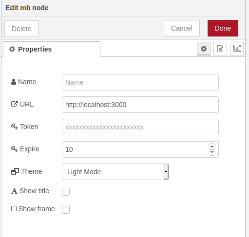
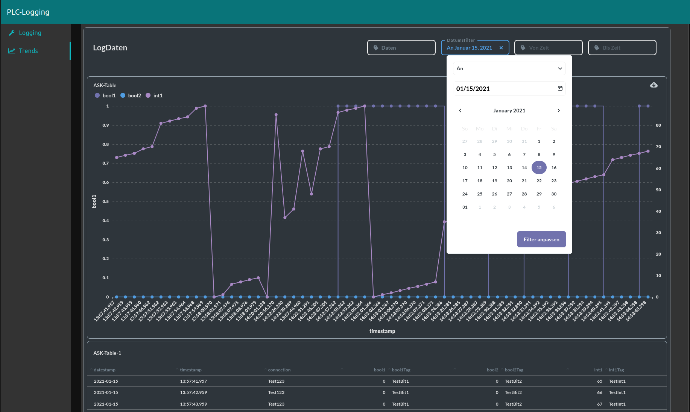
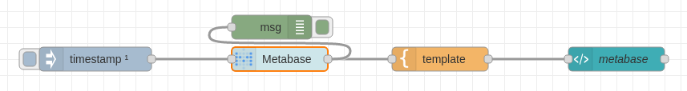

# node-red-contrib-metabase-embed

A simple node to embed Metabase Dashboards and Queries for the Node-RED Dashboard

These nodes uses jsonwebtoken.

## install

To install the node run the following from your Node-RED user directory (`~/.node-red`):

```bash
npm install node-red-contrib-metabase-embed
```

or

Or install the node from the Palette section of your Node-RED editor by searching by name (`node-red-contrib-metabase-embed`).

## configuration



- `Name`    === `Node Name` - Default **Metabase**
- `URL`     === `Web address of Metabase` - Default **http://localhost:3000**
- `Token`   === `Token created by Metabase` - Default **xxxx**
- `Expire`  === `Minuites before link expires` - Default **100**
- `Theme`   === `Theme mode` - Default **Light mode**
- `Title `  === `Show title` - Default **false**
- `Border ` === `Show border` - Default **false**

## Setup Metabase for embedded applications
- See online documention from metabase
- https://www.metabase.com/docs/latest/administration-guide/13-embedding.html#embedding-metabase-in-other-applications

## Usage




## Exsample flow



`[{"id":"19029a14.b18e5e","type":"template","z":"8d02a363.e02f2","name":"","field":"payload","fieldType":"msg","format":"handlebars","syntax":"mustache","template":"<iframe\n    src=\"{{iframeUrl}}\"\n    frameborder=\"0\"\n    width=\"1560\"\n    height=\"1600\"\n    allowtransparency\n></iframe>","x":740,"y":1340,"wires":[["fc355a63.865528"]]},{"id":"fc355a63.865528","type":"ui_template","z":"8d02a363.e02f2","group":"997d0400.2287f8","name":"metabase","order":1,"width":30,"height":30,"format":"<div ng-bind-html=\"msg.payload | trusted\"></div>","storeOutMessages":true,"fwdInMessages":true,"resendOnRefresh":false,"templateScope":"local","x":960,"y":1340,"wires":[[]]},{"id":"30c6b1f7.49e09e","type":"inject","z":"8d02a363.e02f2","name":"","props":[{"p":"payload"}],"repeat":"","crontab":"","once":true,"onceDelay":0.1,"topic":"","payload":"","payloadType":"date","x":310,"y":1340,"wires":[["1f5f37a6.4fddf"]]},{"id":"a045de10.dd5228","type":"debug","z":"8d02a363.e02f2","name":"","active":true,"tosidebar":true,"console":false,"tostatus":false,"complete":"true","targetType":"full","statusVal":"","statusType":"auto","x":530,"y":1300,"wires":[]},{"id":"1f5f37a6.4fddf","type":"mb","z":"8d02a363.e02f2","name":"","url":"http://localhost:3000","token":"32147d2dc0ec7f44bd8bcddd9110d2d50e3f32987fe9dce1405d631af711659a","expire":"10","theme":"theme=night&","title":true,"border":false,"x":520,"y":1340,"wires":[["a045de10.dd5228","19029a14.b18e5e"]]},{"id":"997d0400.2287f8","type":"ui_group","name":"Trend Integer","tab":"e55e7242.05ce4","order":3,"disp":true,"width":"30","collapse":true},{"id":"e55e7242.05ce4","type":"ui_tab","name":"Trends","icon":"fa-line-chart","order":2,"disabled":false,"hidden":false}]`
